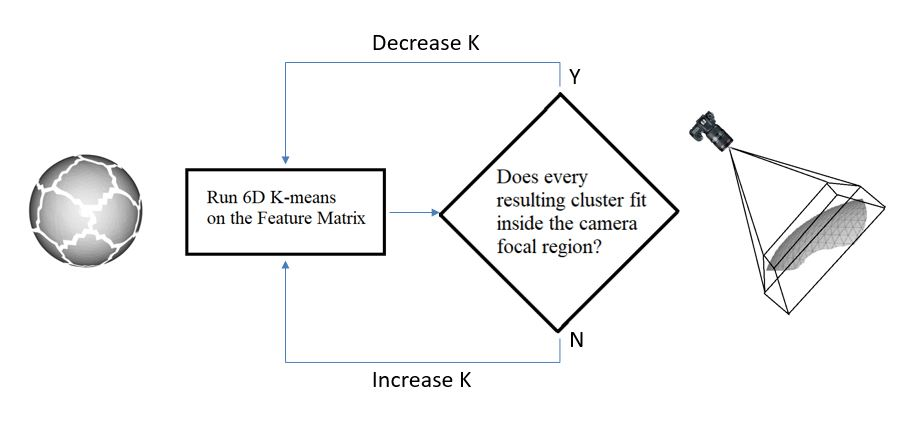

# waypoint_generation

# Introduction

This repository hosts code for a part of my master's thesis at the University of Washington titled "Motion PLanning and Image Capturing for Robotic Inspection of a Curved Surface subject to Imaging Constraints". The objective is to automate the visual inspection of curved surfaces by using a robotic arm and an eye-in-hand camera, by developing a process to exploit geometric characteristics of the surface to be inspected. The central idea is to divide the surface into smaller regions, and then calculate the positions and orientations of the robot arm around the part so as to image it completely. This repository hosts code to automatically generate these waypoints for any part. The input to the pipeline is an STL file, and the output is a list of waypoints.


The idea is to segment the surface of the mesh into clusters, where each cluster is guaranteed to lie within the camera focal region. Mesh segmentation is based on an iterative K-means clustering algorithm - after each round of K-means, it checks if all clusters are smaller than the camera focal region. The K-means parameter "k" is increased/decreased accordingly by using a binary search approach.



# Setup and Test

You need to have these libraries installed:
- Open3D
- NumPy
- Scikit-learn

```
pip install open3d
```

To test the setup, run the main.py script. You should replace the filepaths wherever necessary. The output should be a list of coordinates that are waypoints for inspection (WAYPOINT_XYZ), along with a list of normal directions (WAYPOINT_N)

# Organization

- main.py is the script for the main routine
- /functions contains helper functions with explanantions
- /mesh contains the mesh files

# Notes/Caveats
- Visualizations of each stage of the pipeline are commented out. Uncomment "o3d.visualization.draw_geometries..." to observe the stages
- Name all new STL files as "part_n.STL", where n is a natural number and save them in /mesh
- The visualizations take a lot of time when number of clusters are more than 80.


# Troubleshooting
- The most common error is when there aren't enough points to form clusters, usually when the geometries have extremely thin/flat surfaces
```
RuntimeError: QH6154 Qhull precision error: Initial simplex is flat (facet 1 is coplanar with the interior point)
```
In this case, you can either 1) increase num_vertices in the "MESH PREPROCESSING" section, or 2) decrease bs_high in the "K-MEANS IMPLEMENTATION WITH BINARY SEARCH" section


# Contact
- For questions, email abhishekkoolkarni@gmail.com


